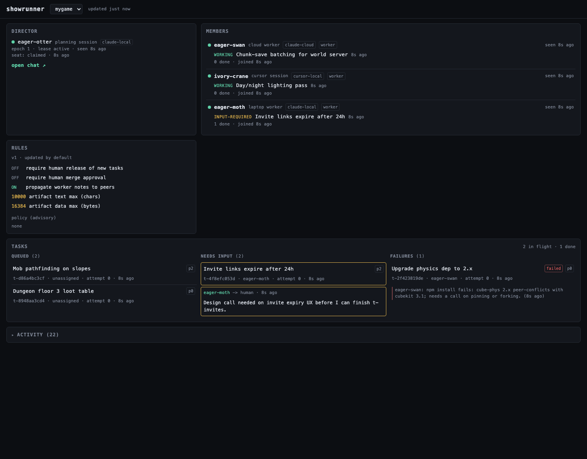

# showrunner

A tiny always-on MCP server that coordinates multiple coding-agent sessions
on one project (a "show"). Deploy it once. Then, from inside any project
repo, tell any agent session, local or cloud, Claude Code or Cursor, "you're
a showrunner worker" and it registers, starts pulling tasks, and reports
back; tell a second session "you're the showrunner director" and it takes
over planning. State lives on the server, not in any session, so sessions
are cattle: kill one anytime and a new one picks up exactly where it left
off. One SQLite file, one static dashboard, ten MCP tools.



(Reproducible: `scripts/seed-demo.mts` fills a local server with this demo show.)

A worker session, after the sentence:

```text
> You're a showrunner worker.

⏺ showrunner:register({show: "mygame", kind: "claude-local"})
  ← member_id "eager-crane"
⏺ showrunner:await_work({member_id: "eager-crane"})
  ← task t-19ebd84582 "Invite links expire after 24h"
⏺ …works the task on a fresh branch, heartbeating update_task…
⏺ showrunner:update_task({status: "input-required", note: "renew flow or plain 410?"})
⏺ showrunner:await_work(…)   ← the director's answer arrives here
```

## Quickstart

```bash
fly launch --no-deploy   # creates the app from fly.toml, skips first deploy
export SHOWRUNNER_TOKEN=$(openssl rand -hex 24)   # keep this shell open
fly secrets set SHOWRUNNER_TOKEN=$SHOWRUNNER_TOKEN
fly deploy
```

Connect a local Claude Code session (same shell, so `$SHOWRUNNER_TOKEN` is still set):

```bash
claude mcp add --transport http showrunner https://<your-app>.fly.dev/mcp \
  --header "Authorization: Bearer $SHOWRUNNER_TOKEN"
```

For Cursor, see the `.cursor/mcp.json` snippet in [examples/](examples/)
(every client's setup is in [docs/OPERATING.md](docs/OPERATING.md)).

Now open a session in any project repo and say:

> "You're a showrunner worker."

Open a second one and say:

> "You're the showrunner director."

The show name comes from the repo: a committed one-line `.showrunner` file
if present, else the git remote or directory name. If your checkouts carry
suffixed names (`mygame-w2`, worktrees), pin it: `echo mygame > .showrunner`.

See [DESIGN.md](DESIGN.md) for why it's built this way, and
[docs/OPERATING.md](docs/OPERATING.md) for everything operational: client
setup, the callboard tour, shared notes, env knobs, the CLI, verifying a
deployment, FAQ, and security posture.

## License

MIT, see [LICENSE](LICENSE).
